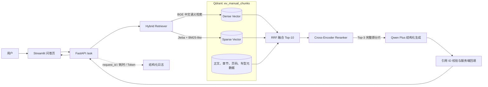
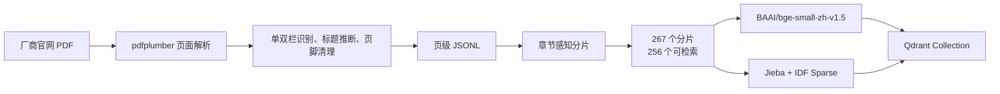
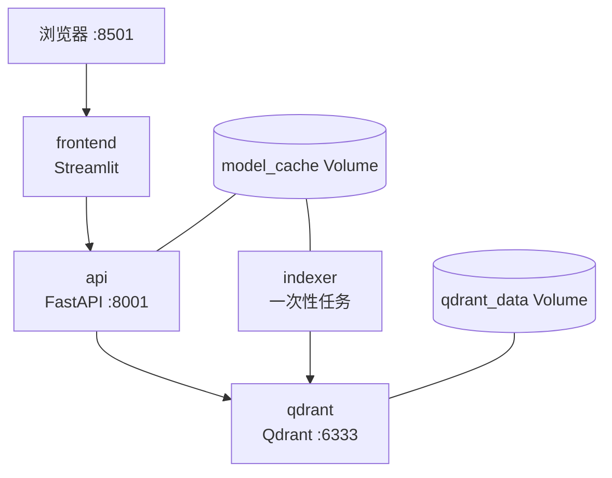

# 系统架构与核心链路

## 架构目标

系统面向新能源汽车用户手册问答，重点解决四个问题：中文说明书结构复杂、关键词与自然语言表达不一致、
长分片的重要信息容易在重排阶段被截断、生成答案必须能够回溯到原始手册。

## 总体架构

这条链路中，Dense 负责语义相似，Sparse 负责车型名、功能名、数值等精确词命中，RRF 在不直接比较
两类分数的情况下融合排序；Cross-Encoder 再对候选问题与分片进行联合打分。

## 离线数据链路

分片默认目标长度为 450 字，最大 800 字，长文本重叠 80 字。分片不会跨越章节或“可检索/不可检索”
边界，并保留 `chunk_id`、章节路径、页码、车型、动力类型、安全等级和来源地址等元数据。目录页等内容
会保留用于审计，但不进入索引，因此生成 267 个分片而向量库保存 256 个可检索分片。

## 在线问答链路

1. FastAPI 接收问题并生成 `request_id`。
2. Qdrant 分别执行 Dense 与 Sparse 检索，通过 RRF 召回 Top-10。
3. Reranker 对候选重新排序。超过 500 字的候选切成 400 字子段、重叠 80 字，分别打分后使用
   Max Pooling 还原为原分片分数，避免答案位于长分片尾部时被截断。
4. 排名前 3 的完整原分片进入 Qwen Plus。模型通过 JSON Schema 返回答案、拒答状态和资料编号。
5. 服务端验证资料编号，只从检索结果回填章节、页码和 `chunk_id`；引用缺失或越界时拒绝输出。
6. 对明显复合问题，在初稿不是拒答时执行一次完整性复核，检查条件、子问题和并列要求是否遗漏。
7. Streamlit 展示答案、引用页码、检索原文、首阶段分数、Reranker 分数、耗时、Token 和请求编号。

## 部署架构

Docker Compose 使用四个服务：`qdrant` 持久化向量数据，`indexer` 在集合不存在时一次性建库，`api`
在索引完成后启动，`frontend` 等待 API 健康后启动。所有宿主机端口仅绑定 `127.0.0.1`。

## 关键技术选择

| 环节 | 方案 | 选择原因 |
| --- | --- | --- |
| PDF解析 | pdfplumber | 能读取文字位置、字号和页面坐标，便于处理单双栏和标题 |
| Dense | BAAI/bge-small-zh-v1.5 | 中文检索效果与本地 CPU 推理成本平衡较好 |
| Sparse | Jieba + BM25-like IDF | 补充专有名词、数值、缩写和精确关键词召回 |
| 融合 | Qdrant RRF | 无需把不同量纲的 Dense/Sparse 分数直接加权 |
| 重排 | mMARCO MiniLM Cross-Encoder | 联合建模问题与候选文本，提高 Top-1 排名质量 |
| 生成 | Qwen Plus + JSON Schema | 中文生成能力、结构化输出和兼容 OpenAI SDK |
| API/UI | FastAPI + Streamlit | 快速形成可演示、可测试、前后端分离的应用 |

## 当前评测结果

- 30题检索集：Hybrid Recall@1 为 86.7%，加入 Reranker 后提升至 96.7%；MRR@5 从 0.919
  提升至 0.978。
- 25题冻结验收集修复后回归：通过率、答案要点召回率、引用命中率、引用精确率和拒答准确率均为
  100%。该结果仅代表当前小规模冻结集，不代表开放域泛化效果。
- 完整性复核带来成本：平均延迟从 3.51 秒增至 4.91 秒，总 Token 从 43,039 增至 72,466。

## 已知边界

- 当前只收录问界 M5 纯电版手册，尚未实现多车型数据管理页面。
- PDF 上传、增量索引、文档版本管理目前通过离线脚本完成。
- 复合问题二次复核提高完整性，但会增加延迟和模型成本。
- 自动评测集规模有限，新增车型或提示词、模型、分片策略变更后仍需补充未见问题并人工抽查。
